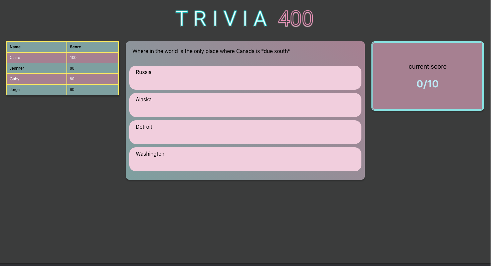
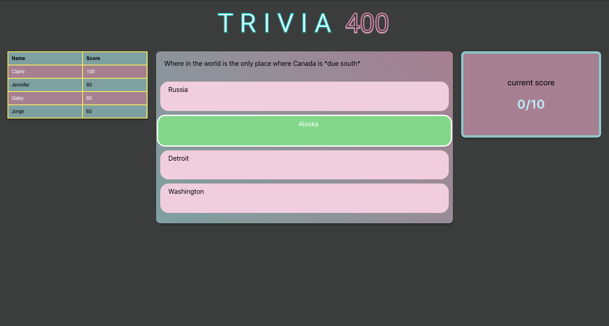
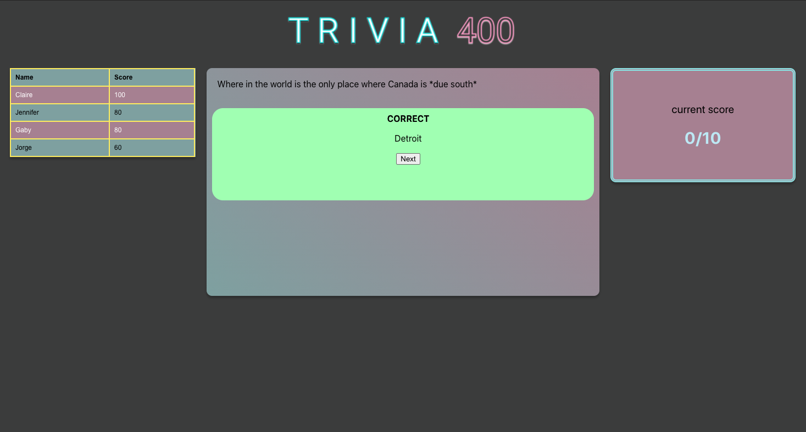
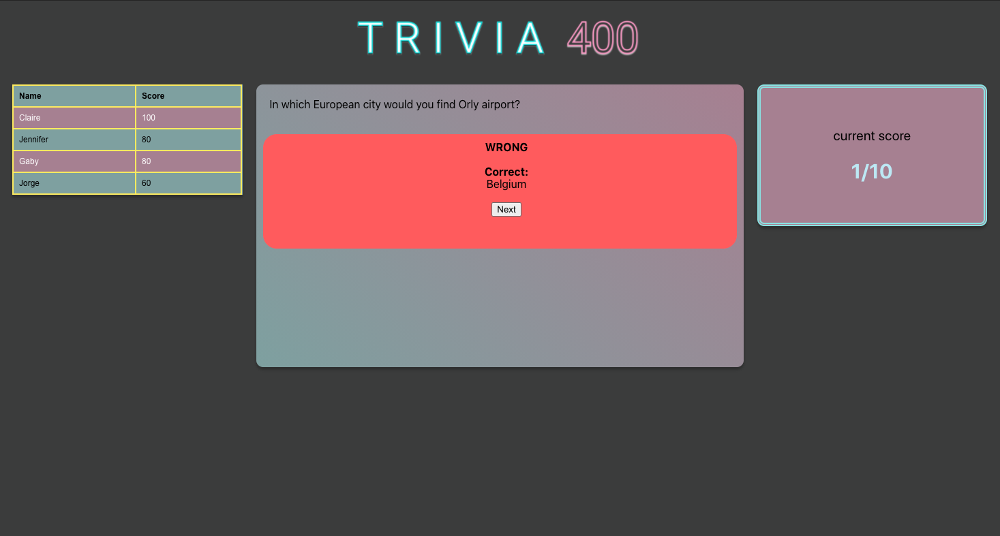
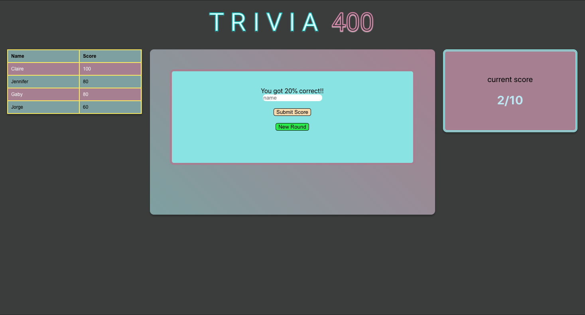

# Tandem 400

Tandem 400 is an application for user to take trivia quizzes and further their knowledge. A user can submit answer and see the right answer if they got it wrong. At the end of the quiz they will have a chance to add their name to leaderboard in order to keep track their score. 

## Installation

1. Clone repo
2. ###### `$ npm install`
     (need to have Node.js installed already )
3. Clone backend repo - [Trivia 400 backend](https://github.com/guillenjs/trivia-app-backend)
4. bundle installs rails api 
    ###### `$ bundle install`
4. run rails server 
    ###### `$ rails s`
5. run front end repo 
    ###### `$ npm start`

## Using application

    Once installed you can enter application and playing trivia games

## Tech Stack    
- Javascript
- React.js 
- Ruby on Rails API
- PostgreSQL
- CSS3

## Tools
 - [ActiveModelSerializers](https://github.com/rails-api/active_model_serializers)
 - [Ruby 2.6.1](https://www.ruby-lang.org/en/news/2019/01/30/ruby-2-6-1-released/)
 - [node v14.4.0](https://nodejs.org/en/blog/release/v14.4.0/)

 ## Examples:

